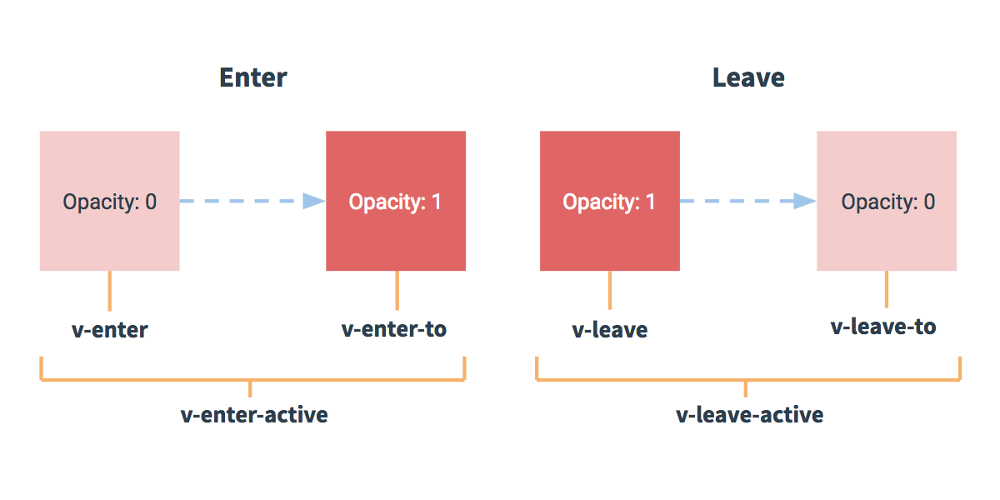

# day2

## 品牌管理案例（看不懂没关系，下面是拆分讲解）

```markup
<!DOCTYPE html>
<!--
    根据关键字实现数组的过滤
    过滤器只能用于插值表达式和v-bind
    Vue中全局过滤器
    定义格式化时间的全局过滤器
    定义私有过滤器
    字符串padStart方法的使用
    默认按键修饰符
        .prevent .enter .tab .delete .esc .space .up .down .left .right 以及按键码keyCode
    自定义按键修饰符
    自定义全局指令
    定义私有指令
 -->
<html lang="en">
<head>
    <head>
        <meta charset='utf-8'>
        <title>阿斯蒂芬仨大发送到发送到</title>
        <!-- 引入vue.js -->
        <script src='https://cdn.jsdelivr.net/npm/vue/dist/vue.js'></script>

        <!-- 最新版本的 Bootstrap 核心 CSS 文件 -->
        <link rel="stylesheet" href="https://cdn.jsdelivr.net/npm/bootstrap@3.3.7/dist/css/bootstrap.min.css"
              integrity="sha384-BVYiiSIFeK1dGmJRAkycuHAHRg32OmUcww7on3RYdg4Va+PmSTsz/K68vbdEjh4u"
              crossorigin="anonymous">
    </head>
</head>
<body>
<div id="app">
    <div class="panel panel-primary">
        <div class="panel-heading">
            <h3 class="panel-title">添加品牌</h3>
        </div>
        <div class="panel-body form-inline">
            <label>Id:
                <input type="text" class="form-control" v-model="id">
            </label>
            <label>Name:
                <input type="text" class="form-control" v-model="name" @keyup.enter="add" @keyup.f2="add">
            </label>
            <input type="button" value="添加" class="btn btn-primary" @click="add">
            <label>搜索名称关键字:
                <!--v-focus添加焦点事件，刚进入页面直接选中-->
                <input type="text" class="form-control" v-focus v-color="'blue'" v-model="keywords">
            </label>
        </div>
    </div>
    <!-- 表格 -->
    <table class="table table-bordered table-hover table-striped">
        <thead>
        <tr>
            <th>ID</th>
            <th>Name</th>
            <th>Ctime</th>
            <th>Operation</th>
        </tr>
        </thead>
        <tbody>
        <!--search()把过滤过的对象传回来进行循环-->
        <tr v-for="item in search(keywords)" :key="item.id">
            <td>{{item.id}}</td>
            <td>{{item.name}}</td>
            <td>{{item.ctime | dataFormat}}</td>
            <!--<td>{{item.ctime | dataFormat("yyyy-mm-dd")}}</td>-->
            <td>
                <!--.prevent修饰符阻止默认事件-->
                <a href="" @click.prevent="del(item.id)">删除</a>
            </td>
        </tr>
        </tbody>
    </table>
</div>
<div id="app2">
    <!--自定义私有指令-->
    <h2 v-color="'pink'" v-fontweight="'800'" v-fontsize="'50'">你好啊</h2>
</div>
</body>
<script>
    // 定义全局过滤器
    // Vue.filter('过滤器名称',function(){})
    Vue.filter('dataFormat', function (datastr, pattern = '') {
        let data = new Date(datastr)
        let year = data.getFullYear()
        let month = data.getMonth() + 1;
        let day = data.getDate()
        let hour = data.getHours()
        let minute = data.getMinutes()
        let second = data.getSeconds()
        // return year + '-' + month + '-' + day
        if (pattern.toLowerCase() === 'yyyy-mm-dd') {
            return `${year}-${month}-${day}`
        } else {
            return `${year}-${month}-${day} ${hour}:${minute}:${second}`
        }
    })
    
    // 自定义全局按键修饰符
    // Vue.config.keyCodes.自定义名称 = keyCode码
    Vue.config.keyCodes.f2 = 113
    
    // 自定义全局指令
    // 使用 vue.directive()定义全局的指令 下例：V-focus
    // 参数1：指令的名称，注意，在定义的时候，指令的名称前面，不需要加v-前缀，但在调用的时候，必须在指令名称前加上v-前缀来进行调用
    // 参数2：是一个对象，这个对象身上，有一些指令相关的函数，这些函数可以在特定的阶段，执行相关的操作
    Vue.directive('focus', {
        bind: function (el) {// 和样式有关的放在bind
            // 在每个函数中，第一个参数永远是el，表示被绑定了指令的那个元素，这个el参数是一个原生的JS对象
            // el.focus()  该操作不生效，时机不对
        },  // 每当指令绑定到元素上的时候(读到内存的时候)，会立刻执行这个 bind 函数，只执行一次
        inserted: function (el) { //和js有关的行为放在inserted
            el.focus()
        },  //inserted表示元素插入到DOM中的时候(插到页面的时候)，会执行 inserted 函数【触发一次】
        updated: function () {
        },  //当VNode（组件）更新的时候，会执行 updated ，可能会触发多次
    })
    Vue.directive('color', {
        bind: function (el, binding) {
            console.log(binding)
            el.style.color = binding.value
        },  //每当指令绑定到元素上的时候，会立刻执行这个 bind 函数，只会执行一次
    })
    let vm = new Vue({
        el: "#app",
        data: {
            id: '',
            name: '',
            keywords: '',
            list: [
                {id: 1, name: '奔驰', ctime: new Date()},
                {id: 2, name: '宝马', ctime: new Date()},
            ]
        },
        methods: {
            add() { //添加方法
                console.log("添加方法")
                // 判断有没有输入
                if (this.id == '' || this.name == '') alert("输入不完整")
                // 添加到list
                this.list.push({id: this.id, name: this.name, ctime: new Date()})
                // 恢复初始值
                this.id = this.name = ''
            },
            del(id) {
                console.log("删除方法")
                // console.log(id)
                // this.list.some((item,i)=>{
                //     if(item.id == id){
                //         this.list.splice(i,1)
                //         // 在数组的some方法中，如果return true就会立即停止后续循环
                //         return true
                //     }
                // })
                let index = this.list.findIndex(item => item.id === id)
                this.list.splice(index, 1)
            },
            search(keywords) {
                /* 方法一
                let newList = []
                this.list.forEach(item => {
                    // 如果每一个name都包含keywords，索引肯定不是-1
                    if (item.name.indexOf(keywords) != -1){
                        newList.push(item)
                    }
                })
                return newList
                */
                /*补充
                * forEach some filter findIndex 这些都是数组新方法，都能遍历数组
                * 不同点：
                * forEach 不能被终止，some会被return true就会终止
                * filter进行过滤的，findIndex是找到对应项索引
                */
                // 方法二
                // return this.list.filter(item => {
                //     if (item.name.includes(keywords)) return item
                // })
                // 方法二这种写法也行
                return this.list.filter(item => item.name.includes(keywords))
            }
        },
        
        // 私有（局部）过滤器——过滤器有两个条件-【过滤器名称和处理函数】
        // 过滤器调用的原则为就近原则
        filters: {
            //.toString().padStart(2, '0'),是个位秒变成10-53-03这种，而不是10-53-3
            dataFormat: function (datastr, pattern = '') {
                let data = new Date(datastr)
                let year = data.getFullYear()
                let month = (data.getMonth() + 1).toString().padStart(2, '0')
                let day = data.getDate().toString().padStart(2, '0')
                let hour = data.getHours().toString().padStart(2, '0')
                let minute = data.getMinutes().toString().padStart(2, '0')
                let second = data.getSeconds().toString().padStart(2, '0')
                // return year + '-' + month + '-' + day
                if (pattern.toLowerCase() === 'yyyy-mm-dd') {
                    return `${year}-${month}-${day}`
                } else {
                    return `${year}-${month}-${day} ${hour}:${minute}:${second}`
                }
            }
        }
    })
    let vm2 = new Vue({
        el: '#app2',
        data: {},
        directives: {
            //自定义私有指令
            // 设置字体加粗
            'fontweight': {
                bind: function (el, binding) {
                    el.style.fontWeight = binding.value
                }
            },
            // 设置字体大小
            'fontsize': function (el, binding) {
                //如果不加bind，就等同于把代码写到了bind和update中去，简写
                el.style.fontSize = binding.value + 'px'
            }
        }
    })
</script>
</html>
```

### 根据条件筛选品牌

在1.x 版本中的filterBy指令，在2.x中已经被废除：[filterBy - 指令](https://v1-cn.vuejs.org/api/#filterBy)

```markup
<tr v-for="item in list | filterBy searchName in 'name'">
  <td>{{item.id}}</td>
  <td>{{item.name}}</td>
  <td>{{item.ctime}}</td>
  <td>
    <a href="#" @click.prevent="del(item.id)">删除</a>
  </td>
</tr>
```

**2.x常用的绑定方式（这里只是自己写筛选函数，不是过滤器，过滤器需要用 \|）**

1. 在2.x版本中[手动实现筛选的方式](https://cn.vuejs.org/v2/guide/list.html#显示过滤-排序结果)：
2. 筛选框绑定到 VM 实例中的 `searchName` 属性：
3. 在使用 `v-for` 指令循环每一行数据的时候，不再直接 `item in list`，而是 `in` 一个 过滤的methods 方法，同时，把过滤条件`searchName`传递进去：
4. `search` 过滤方法中，**使用 数组的 `filter` 方法进行过滤，最后一定要返回过滤或排序后的数组**：

```markup
<hr> 输入筛选名称：
<input type="text" v-model="searchName"><!--双向绑定一个数据-->
<tbody>
      <tr v-for="item in search(searchName)"><!--含有该数据的对象才会显示-->
        <td>{{item.id}}</td>
        <td>{{item.name}}</td>
        <td>{{item.ctime}}</td>
        <td>
          <a href="#" @click.prevent="del(item.id)">删除</a>
        </td>
      </tr>
</tbody><!--自定义过滤器方法,filter详情见下方-->
search(name) { 
  return this.list.filter(x => x.name.indexOf(name) != -1);
}
```

### **ES6数组方法回忆**

* **Array.every\(x=&gt;x\)是每一个都要满足**
* **Array.some\(x=&gt;x\)是有一个满足。**
* **Array.find（条件）返回符合条件的第一个值。**
* **Array.filter（条件），条件为函数，保存所有满足条件的项，组成新的数组**

数组的方法分为两类

1）改变原数组**：**push,pop,shift,unshift,sort,reverse,splice

2）不改变原数组concat,join,split，toStringpush：从数组最后一位开始加数据

## 过滤器

概念：Vue.js 允许你自定义过滤器，**可被用作一些常见的文本格式化**。过滤器可以用在两个地方：**mustache 插值和 v-bind 表达式**。过滤器应该被添加在 JavaScript 表达式的尾部，由“管道”符指示；

HTML元素：

```markup
<td>{{item.ctime | dataFormat('yyyy-mm-dd')}}</td>
```

> 注意：当有局部和全局两个名称相同的过滤器时候，会以就近原则进行调用，即：局部过滤器优先于全局过滤器被调用！

### 全局过滤器

全局过滤器，直接写在script标签里面不需要写在new vue里

```javascript
Vue.filter('dataFormat', function (ctime, pattern = '') {
  //filter第一个参数为过滤器引用名，后面为过滤函数
  //function的第一个参数为管道符前面的需要过滤的变量，第二个及以后参数是管道符后面的函数的参数
  var dt = new Date(ctime);//传进来当前时间，根据当前时间来生成时间
  // 获取年月日
  var y = dt.getFullYear();
  var m = (dt.getMonth() + 1).toString().padStart(2, '0');
  var d = dt.getDate().toString().padStart(2, '0');
  // 如果 传递进来的字符串类型，转为小写之后，等于 yyyy-mm-dd，那么就返回 年-月-日
  // 否则，就返回  年-月-日 时：分：秒
  if (pattern.toLowerCase() === 'yyyy-mm-dd') {
    return `${y}-${m}-${d}`;
  } else {
    // 获取时分秒
    var hh = dt.getHours().toString().padStart(2, '0');
    var mm = dt.getMinutes().toString().padStart(2, '0');
    var ss = dt.getSeconds().toString().padStart(2, '0');
    return `${y}-${m}-${d} ${hh}:${mm}:${ss}`;
  }
});
```

### 私有过滤器

私有 `filters` 定义方式：要写在new vue 里面

```javascript
filters: { 
// 私有局部过滤器，只能在 当前 VM 对象所控制的 View 区域进行使用
// 要写在new Vue({这里面})
// 函数名即为过滤器的引用名，第一个参数为管道符前面的需要过滤的变量，
// 第二个及以后参数是管道符后面的函数的参数
    dataFormat(ctime, pattern = "") { 
    // 在参数列表中 通过 pattern="" 来指定形参默认值，防止报错
      var dt = new Date(ctime);
      // 获取年月日
      var y = dt.getFullYear();
      var m = (dt.getMonth() + 1).toString().padStart(2, '0');
      var d = dt.getDate().toString().padStart(2, '0');
      // 如果 传递进来的字符串类型，转为小写之后，等于 yyyy-mm-dd，那么就返回 年-月-日
      // 否则，就返回  年-月-日 时：分：秒
      if (pattern.toLowerCase() === 'yyyy-mm-dd') {
        return `${y}-${m}-${d}`;
      } else {
        // 获取时分秒
        var hh = dt.getHours().toString().padStart(2, '0');
        var mm = dt.getMinutes().toString().padStart(2, '0');
        var ss = dt.getSeconds().toString().padStart(2, '0');
        return `${y}-${m}-${d} ${hh}:${mm}:${ss}`;
      }
    }
  }
```

> 使用ES6中的字符串新方法 String.prototype.padStart\(maxLength, fillString=''\) 或 String.prototype.padEnd\(maxLength, fillString=''\)来填充字符串；

### 键盘修饰符以及自定义键盘修饰符

```markup
<!-- vue对应的按键事件绑定是 v-on:keyup.自定义按键变量  
或者 @keyup.自定义按键变量 ,这里按键变量就是f2-->
<!-- 在input输入框里面添加键盘事件,当键盘按下f2的时候会发出113键盘码,
自定义的按键事件f2可以捕捉到113键盘码-->
<div id="test">
    <input type="text" @keyup.f2="show" @keyup.enter="show"/>
    <!-- 注意keyup事件只能用在input里面-->
    <!-- 而且只有光标在input里面的时候输入按键会触发-->
    <!-- 在登陆界面,你可以为所有需要输入的input都设置keyup事件-->
    <input type="button" @click.prevent="show" value="button"/> <br/>
    <p>点击button按钮,查看弹窗, <br/>或者</p>
</div>
<script>
    Vue.config.keyCodes.f2 = 113;
    var vm1 = new Vue({
        el:"#test",
        methods:{
            show: function () {
                alert("登陆成功")
            }
        }
    });
</script>
```

#### 自定义键盘修饰符（分为vue1.x和vue2.x两个版本的定义方式）

Vue 提供了绝大多数常用的按键码的别名：

.enter .tab .delete \(捕获“删除”和“退格”键\) .esc .space .up .down .left .right

```javascript
Vue.config.keyCodes.f2 = 113;//vue2.x版本定义键盘修饰符
Vue.directive('on').keyCodes.f2 = 113; //vue1.x版本定义键盘修饰符
<input type="text" @keyup.f2="show" @keyup.enter="show"/>//使用
```

## [自定义指令](https://cn.vuejs.org/v2/guide/custom-directive.html)

自定义全局和局部的 自定义指令：

```javascript
// 自定义全局指令
// 使用 vue.directive()定义全局的指令 下例：V-focus,V-color8
// 参数1：指令的名称，注意，在定义的时候，指令的名称前面，不需要加v-前缀，
//       但在调用的时候，必须在指令名称前加上v-前缀来进行调用
// 参数2：是一个对象，这个对象身上，有一些指令相关的函数，
//       这些函数可以在特定的阶段，执行相关的操作
Vue.directive('focus', {
// 每当指令绑定到元素上的时候(读到内存的时候)，会立刻执行这个 bind 函数，只执行一次
    bind: function (el) {// 和样式有关的放在bind
    //在每个函数中，第一个参数永远是el，表示被绑定了指令的那个元素，这个el参数是一个原生的JS对象
    // el.focus()  该操作不生效，时机不对
    },  
    inserted: function (el) { //和js有关的行为放在inserted
        el.focus()
    },  //inserted表示元素插入到DOM中的时候(插到页面的时候)，会执行 inserted 函数【触发一次】
    updated: function () {
    },  //当VNode（组件）更新的时候，会执行 updated ，可能会触发多次
})
Vue.directive('color', {
    bind: function (el, binding) {
    //第一个参数表示被绑定的那个元素，第二个参数为V-color=“xxx”的xxxx
        console.log(binding)
        el.style.color = binding.value
    },  //每当指令绑定到元素上的时候，会立刻执行这个 bind 函数，只会执行一次
})

// 自定义局部指令 v-color 和 v-font-weight，为绑定的元素设置指定的字体颜色和字体粗细：
// 自定义局部指令要写在new Vue({这里面})
directives: {
  color: { // 为元素设置指定的字体颜色
    bind(el, binding) {
      el.style.color = binding.value;
    }
  },
  'font-weight': function (el, binding2) { 
// 自定义指令的简写形式，等同于定义了 bind 和 update 两个钩子函数
    el.style.fontWeight = binding2.value;
  }
}
```

1. 自定义指令的使用方式：

```markup
<input type="text" v-model="searchName" v-focus v-color="'red'" v-font-weight="900">
```

### Vue 1.x 中 自定义元素指令【已废弃,了解即可】

```javascript
Vue.elementDirective('red-color', {
  bind: function () {
    this.el.style.color = 'red';
  }
});
```

使用方式：

```markup
<red-color>1232</red-color>
```

## [vue实例的生命周期](https://cn.vuejs.org/v2/guide/instance.html#实例生命周期)


* 什么是生命周期：从Vue实例创建、运行、到销毁期间，总是伴随着各种各样的事件，这些事件，统称为生命周期！
* [生命周期钩子](https://cn.vuejs.org/v2/api/#选项-生命周期钩子)：就是生命周期事件的别名而已；
* 生命周期钩子 = 生命周期函数 = 生命周期事件
* 主要的生命周期函数分类：
  * 创建期间的生命周期函数：
    * beforeCreate：实例刚在内存中被创建出来，此时，还没有初始化好 data 和 methods 属性
    * created：实例已经在内存中创建OK，此时 data 和 methods 已经创建OK，此时还没有开始 编译模板
    * beforeMount（挂载前）：此时已经完成了模板的编译，但是还没有挂载到页面中
    * mounted（挂载）：此时，已经将编译好的模板，挂载到了页面指定的容器中显示
  * 运行期间的生命周期函数：
    * beforeUpdate：状态更新之前执行此函数， 此时 data 中的状态值是最新的，但是界面上显示的 数据还是旧的，因为此时还没有开始重新渲染DOM节点
    * updated：实例更新完毕之后调用此函数，此时 data 中的状态值 和 界面上显示的数据，都已经完成了更新，界面已经被重新渲染好了！
  * 销毁期间的生命周期函数：
    * beforeDestroy：实例销毁之前调用。在这一步，实例仍然完全可用。
    * destroyed：Vue 实例销毁后调用。调用后，Vue 实例指示的所有东西都会解绑定，所有的事件监听器会被移除，所有的子实例也会被销毁。

## [vue-resource 实现 get, post, jsonp请求](https://github.com/pagekit/vue-resource)

**vue-resource是Vue.js的一款插件**，它可以通过XMLHttpRequest或JSONP发起请求并处理响应。也就是说，$.ajax能做的事情，vue-resource插件一样也能做到，而且vue-resource的API更为简洁。另外，vue-resource还提供了非常有用的inteceptor功能，使用inteceptor可以在请求前和请求后附加一些行为，比如使用inteceptor在ajax请求时显示loading界面。

除了 vue-resource 之外，还可以使用 `axios` 的第三方包实现实现数据的请求 1. 之前的学习中，如何发起数据请求？ 2. 常见的数据请求类型？ get post jsonp 3. 测试的URL请求资源地址：

* get请求地址：[http://www.liulongbin.top:3005/api/getlunbo](http://www.liulongbin.top:3005/api/getlunbo)
* post请求地址：[http://www.liulongbin.top:3005/api/post](http://www.liulongbin.top:3005/api/post)
* jsonp请求地址：[http://www.liulongbin.top:3005/api/jsonp](http://www.liulongbin.top:3005/api/jsonp)

JSONP的实现原理

* 由于浏览器的安全性限制，不允许AJAX访问 协议不同、域名不同、端口号不同的 数据接口，浏览器认为这种访问不安全；
* 可以通过动态创建script标签的形式，把script标签的src属性，指向数据接口的地址，因为script标签不存在跨域限制，这种数据获取方式，称作JSONP（注意：根据JSONP的实现原理，知晓，JSONP只支持Get请求）；
* 具体实现过程：
  * 先在客户端定义一个回调方法，预定义对数据的操作；
  * 再把这个回调方法的名称，通过URL传参的形式，提交到服务器的数据接口；
  * 服务器数据接口组织好要发送给客户端的数据，再拿着客户端传递过来的回调方法名称，拼接出一个调用这个方法的字符串，发送给客户端去解析执行；
  * 客户端拿到服务器返回的字符串之后，当作Script脚本去解析执行，这样就能够拿到JSONP的数据了；

vue-resource 的配置步骤：

* 直接在页面中，通过`script`标签，引入 `vue-resource` 的脚本文件；
* 注意：引用的先后顺序是：先引用 `Vue` 的脚本文件，再引用 `vue-resource` 的脚本文件；

```markup
<!DOCTYPE html>
<html lang="en">
<head>
    <meta charset="UTF-8">
    <title>Title</title>
</head>
<body>
<div class="app">
    <input type="button" value="get" @click="getInfo">
    <input type="button" value="post" @click="postInfo">
    <input type="button" value="jsonp" @click="jsonpInfo">
</div>
</body>
<script src="lib/vue.js"></script>
<script src="lib/vue-resource-1.3.4.js"></script>
<script>
    let vm = new Vue({
        el: ".app", //和类绑定
        data: {},
        methods: {
            getInfo() {
                console.log("发送get请求")
                this.$http.get('http://www.liulongbin.top:3005/api/getlunbo').then(function (res) {
                    console.log(res.body)
                })
            },
            postInfo() {
                console.log("发送post请求")
                // 手动发起的Post 请求，默认没有表单格(application/x-www-form-urlencoded)，所以，有的服务器处理不了
                // 需要加上emulateJSON:true
                this.$http.post("http://www.liulongbin.top:3005/api/post", {}, {emulateJSON: true}).then(res => {
                    console.log(res)
                })
            },
            jsonpInfo() {
                console.log("发送jsonp请求")
                //
                this.$http.jsonp("http://www.liulongbin.top:3005/api/jsonp").then(res => {
                    console.log(res)
                })
            }
        },
    })
</script>
</html>
```

发送get请求：

```javascript
getInfo() { // get 方式获取数据
    this.$http.get('http://127.0.0.1:8899/api/getlunbo').then(res => {
    console.log(res.body);
    })
}
```

发送post请求：

```javascript
postInfo() {
    var url = 'http://127.0.0.1:8899/api/post';
    // post 方法接收三个参数：
    // 参数1： 要请求的URL地址
    // 参数2： 要发送的表单数据
    // 参数3： 指定post提交的编码类型为 application/x-www-form-urlencoded
    this.$http.post(url, { name: 'zs' }, { emulateJSON: true }).then(res => {
    console.log(res.body);
    });
}
```

发送JSONP请求获取数据：

```javascript
jsonpInfo() { // JSONP形式从服务器获取数据
    var url = 'http://127.0.0.1:8899/api/jsonp';
    this.$http.jsonp(url).then(res => {
    console.log(res.body);
    });
}
```

### 品牌管理改造（运行不出来，因为测试网站挂了，但是设计思路很好）

```markup
<html>
<head>
    <meta charset='utf-8'>
    <title></title>
    <!-- 引入vue.js -->
    <script src='https://cdn.jsdelivr.net/npm/vue/dist/vue.js'></script>
    <!-- 最新版本的 Bootstrap 核心 CSS 文件 -->
    <link rel="stylesheet" href="https://cdn.jsdelivr.net/npm/bootstrap@3.3.7/dist/css/bootstrap.min.css"
          integrity="sha384-BVYiiSIFeK1dGmJRAkycuHAHRg32OmUcww7on3RYdg4Va+PmSTsz/K68vbdEjh4u" crossorigin="anonymous">
    <!-- 引入vue-resource -->
    <script src="https://cdn.jsdelivr.net/npm/vue-resource@1.5.1"></script>
</head>
<body>
<div id='app'>
    <div class="panel panel-primary">
        <div class="panel-heading">
            <h3 class="panel-title">添加品牌</h3>
        </div>
        <div class="panel-body form-inline">
            <label>Name:
                <input type="text" class="form-control" v-model="name" @keyup.enter="add">
            </label>
            <input type="button" value="添加" class="btn btn-primary" @click="add">
        </div>
    </div>
    <!-- 表格 -->
    <table class="table table-bordered table-hover table-striped">
        <thead>
        <tr>
            <th>ID</th>
            <th>Name</th>
            <th>Ctime</th>
            <th>Operation</th>
        </tr>
        </thead>
        <tbody>
        <tr v-for="item in list" :key="item.id">
            <td>{{item.id}}</td>
            <td>{{item.name}}</td>
            <td>{{item.ctime | dataFormat}}</td>
            <td>
                <a href="" @click.prevent="del(item.id)">删除</a>
            </td>
        </tr>
        </tbody>
    </table>
</div>
</body>
<script>
    // 定义全局过滤器
    // Vue.filter('过滤器名称',function(){})
    Vue.filter('dataFormat', function (datastr, pattern = '') {
        let data = new Date(datastr)
        let year = data.getFullYear()
        let month = data.getMonth() + 1;
        let day = data.getDate()
        let hour = data.getHours()
        let minute = data.getMinutes()
        let second = data.getSeconds()
        // return year + '-' + month + '-' + day
        if (pattern.toLowerCase() === 'yyyy-mm-dd') {
            return `${year}-${month}-${day}`
        } else {
            return `${year}-${month}-${day} ${hour}:${minute}:${second}`
        }
    })
    Vue.http.options.root = "http://mycode.com/" // 设置根目录。下面请求路径可以少写
    Vue.http.options.emulateJSON = true
    // 实例化vue对象
    let vm = new Vue({
        // 绑定对象
        el: '#app',
        data: {
            name: '',
            list: [
                {id: 1, name: '奔驰', ctime: new Date()},
                {id: 2, name: '宝马', ctime: new Date()}
            ]
        },
        methods: {
            add() { //添加方法
                console.log("添加方法")
                if (this.name == '') {
                    alert("请填写name")
                    return
                }
                this.$http.post("vuejs/phpcode/post.php", {name: this.name}).then(res => {
                    if (res.status !== 0) { // 提交表单，如果成果则进行数据替换
                        this.getAllList()
                    } else {
                        alert("出错了")
                    }
                })
                this.name = ''
            },
            getAllList() { // get请求得到数据库的内容，把list替换成数据库的内容
                this.$http.get("vuejs/phpcode/get.php").then(res => {
                    console.log(res)
                    if (res.status !== 0) {
                        this.list = res.body.message  // 替换
                    } else {
                        alert("获取数据失败!")
                    }
                })
            },
            del(id) {
                this.$http.get("vuejs/phpcode/del.php?id=" + id).then(res => {
                    console.log(res)
                    if (res.status !== 0) {
                        this.getAllList()
                    } else {
                        alert("失败了!")
                    }
                })
            },
        },
        created() {  //最先执行这个
            this.getAllList()
        },
    })
</script>
</html>
```

## [Vue中的动画](https://cn.vuejs.org/v2/guide/transitions.html)

为什么要有动画：动画能够提高用户的体验，帮助用户更好的理解页面中的功能；

#### 过渡的类名 <a id="&#x8FC7;&#x6E21;&#x7684;&#x7C7B;&#x540D;"></a>

在进入/离开的过渡中，会有 6 个 class 切换。

1. `v-enter`：定义进入过渡的开始状态。在元素被插入之前生效，在元素被插入之后的下一帧移除。
2. `v-enter-active`：定义进入过渡生效时的状态。在整个进入过渡的阶段中应用，在元素被插入之前生效，在过渡/动画完成之后移除。这个类可以被用来定义进入过渡的过程时间，延迟和曲线函数。
3. `v-enter-to`: **2.1.8版及以上** 定义进入过渡的结束状态。在元素被插入之后下一帧生效 \(与此同时 `v-enter` 被移除\)，在过渡/动画完成之后移除。
4. `v-leave`: 定义离开过渡的开始状态。在离开过渡被触发时立刻生效，下一帧被移除。
5. `v-leave-active`：定义离开过渡生效时的状态。在整个离开过渡的阶段中应用，在离开过渡被触发时立刻生效，在过渡/动画完成之后移除。这个类可以被用来定义离开过渡的过程时间，延迟和曲线函数。
6. `v-leave-to`: **2.1.8版及以上** 定义离开过渡的结束状态。在离开过渡被触发之后下一帧生效 \(与此同时 `v-leave` 被删除\)，在过渡/动画完成之后移除。



### 1、使用过渡类名

HTML结构：

```markup
<div id="app">
 <input type="button" value="动起来" @click="myAnimate">
 <!-- 使用 transition 将需要过渡的元素包裹起来 -->
 <transition name="fade"> <!-- name代表css类的前缀名相同才有效 -->
   <div v-show="isshow">动画哦</div>
 </transition>
</div>
```

VM 实例：

```javascript
// 创建 Vue 实例，得到 ViewModel
var vm = new Vue({
el: '#app',
data: {
 isshow: false
},
methods: {
 myAnimate() {
   this.isshow = !this.isshow;
 }
}
});
```

定义两组类样式：

```css
/* 定义进入和离开时候的过渡状态 */
/*fade是前缀名*/
 .fade-enter-active,
 .fade-leave-active {
   transition: all 0.2s ease;
   position: absolute;
 }
 /* 定义进入过渡的开始状态 和 离开过渡的结束状态 */
 .fade-enter,
 .fade-leave-to {
   opacity: 0;
   transform: translateX(100px);
 }
```

通过html和css统一前缀名，即可自定义动画

### 2、[使用第三方 CSS 动画库](https://cn.vuejs.org/v2/guide/transitions.html#自定义过渡类名)

导入动画类库：

```text
<link rel="stylesheet" type="text/css" href="./lib/animate.css">
```

定义 transition 及属性：

```markup
<transition
 enter-active-class="fadeInRight"
 leave-active-class="fadeOutRight"
 :duration="{ enter: 500, leave: 800 }"> // duration是动画的延迟
   <div class="animated" v-show="isshow">动画哦</div>
</transition>
```

### 使用动画钩子函数

定义 transition 组件以及三个钩子函数：

```markup
<div id="app">
 <input type="button" value="切换动画" @click="isshow = !isshow">
 <transition
 @before-enter="beforeEnter"  
 @enter="enter"
 @after-enter="afterEnter">
 <!--三个钩子进入前，进入时，进入后-->
   <div v-if="isshow" class="show">OK</div>
 </transition>
</div>
```

定义三个 methods 钩子方法：

```javascript
methods: {
     beforeEnter(el) { // 动画进入之前的回调
       el.style.transform = 'translateX(500px)';
     },
     enter(el, done) { // 动画进入完成时候的回调
       el.offsetWidth;
       el.style.transform = 'translateX(0px)';
       done();
     },
     afterEnter(el) { // 动画进入完成之后的回调
       this.isshow = !this.isshow;
     }
   }
```

定义动画过渡时长和样式：

```css
.show{
   transition: all 0.4s ease;
 }
```

### [v-for 的列表过渡](https://cn.vuejs.org/v2/guide/transitions.html#列表的进入和离开过渡)

定义过渡样式：

```css
 .list-enter,
 .list-leave-to {
   opacity: 0;
   transform: translateY(10px);
 }
 .list-enter-active,
 .list-leave-active {
   transition: all 0.3s ease;
 }
```

定义DOM结构，其中，需要使用 transition-group 组件把v-for循环的列表包裹起来：

```markup
<div id="app">
 <input type="text" v-model="txt" @keyup.enter="add">

 <transition-group tag="ul" name="list"> 
 <!--默认transition会渲染成span，用tag渲染成指定的标签名-->
   <li v-for="(item, i) in list" :key="i">{{item}}</li>
 </transition-group>
</div>
```

**注意：**

定义 VM中的结构：

```javascript
 // 创建 Vue 实例，得到 ViewModel
 var vm = new Vue({
   el: '#app',
   data: {
     txt: '',
     list: [1, 2, 3, 4]
   },
   methods: {
     add() {
       this.list.push(this.txt);
       this.txt = '';
     }
   }
 });
```

### 列表的排序过渡

`<transition-group>` 组件还有一个特殊之处。不仅可以进入和离开动画，**还可以改变定位**。要使用这个新功能只需了解新增的 `v-move` 特性，**它会在元素的改变定位的过程中应用**。

* `v-move` 和 `v-leave-active` 结合使用，能够让列表的过渡更加平缓柔和：

  ```css
  .v-move{
      transition: all 0.8s ease;
  }
  .v-leave-active{
      position: absolute;
  }
  ```

## 相关文章

1. [vue.js 1.x 文档](https://v1-cn.vuejs.org/)
2. [vue.js 2.x 文档](https://cn.vuejs.org/)
3. [String.prototype.padStart\(maxLength, fillString\)](http://www.css88.com/archives/7715)
4. [js 里面的键盘事件对应的键码](http://www.cnblogs.com/wuhua1/p/6686237.html)
5. [pagekit/vue-resource](https://github.com/pagekit/vue-resource)
6. [navicat如何导入sql文件和导出sql文件](https://jingyan.baidu.com/article/a65957f4976aad24e67f9b9b.html)
7. [贝塞尔在线生成器](http://cubic-bezier.com/#.4,-0.3,1,.33)

