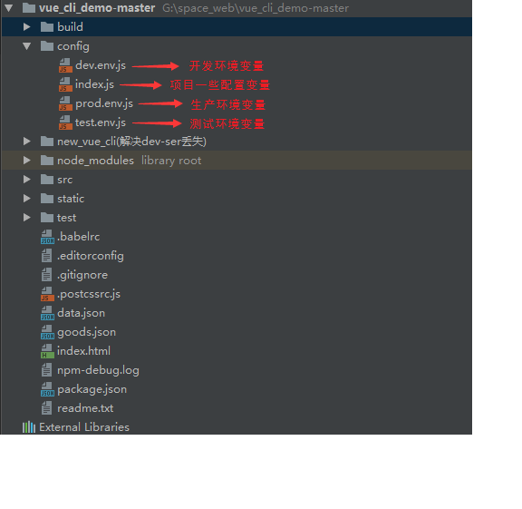

# vue-cli

vue-cli是官方提供的快速构建这个单页面应用的脚手架。

## 安装

老版本（本文档版本）：npm instal vue-cli （-g）加上-g安装到全局，推荐安装到全局

新版本（官方文档版本）： Vue CLI 的包名称由 `vue-cli` 改成了 `@vue/cli`。 如果你已经全局安装了旧版本的 `vue-cli` \(1.x 或 2.x\)，你需要先通过 `npm uninstall vue-cli -g` 或 `yarn global remove vue-cli` 卸载它。



```text
npm install -g @vue/cli
# OR
yarn global add @vue/cli
```



用这个命令来检查其版本是否正确：

```text
vue --version
```

**依赖：**

**vue-cli需要依赖webpack，所以vue-cli里面自带了webpack**

## [ubuntu下安装vue-cli框架](https://www.cnblogs.com/teersky/p/7245119.html)

首先安装好node.js,安装方式见[http://www.cnblogs.com/teersky/p/7255334.html](http://www.cnblogs.com/teersky/p/7255334.html)

之后正式开始vue-cli之旅吧，输入以下代码安装vue-cli模块

```text
sudo npm i vue-cli -g
```

这一步完成之后可以查看vue的版本，用以下代码查看：

```text
vue -V     //此处V必须时大写
```

## **初始化项目**

### ubuntu系统

新建一个基于webpack模板的新项目project，安装过程中需要你输入一些信息\(名称，描述和作者\)

```text
sudo vue init webpack project
```

之后进入项目

```text
cd project
npm install (sudo npm install) // 下载依赖
npm run dev
```

到这儿vue-cli框架搭建也就完成了

注：国内因为墙的原因，npm服务器会让人很抓狂，建议使用国内镜像

```text
sudo npm install -g cnpm --registry=https://registry.npm.taobao.org
```

此处因为没带sudo我死了好多次

### windows系统

安装完成后在自己的工作空间里

```text
vue init webpack vue-demo  
```

输入命令后进入安装阶段，需要用户输入一些信息 

* Project name \(vue-demo\)： -----项目名称，直接回车，按照括号中默认名字（注意这里的名字不能有大写字母，如果有会报错Sorry, name can no longer contain capital letters），阮一峰老师博客[为什么文件名要小写](https://link.jianshu.com?t=http://www.ruanyifeng.com/blog/2017/02/filename-should-be-lowercase.html) ，可以参考一下。
* Project description \(A Vue.js project\)： ----项目描述，也可直接点击回车，使用默认名字
* Author \(\)： ----作者，输入xxxxxxxx

接下来会让用户选择：

* Runtime + Compiler: recommended for most users 运行加编译，既然已经说了推荐，就选它了  Runtime-only: about 6KB lighter min+gzip, but templates \(or any Vue-specificHTML\) are ONLY allowed in .vue files - render functions are required elsewhere 仅运行时，已经有推荐了就选择第一个了
* Install vue-router? \(Y/n\) 是否安装vue-router，这是官方的路由，大多数情况下都使用，这里就输入“y”后回车即可。
* Use ESLint to lint your code? \(Y/n\) 是否使用ESLint管理代码，ESLint是个代码风格管理工具，是用来统一代码风格的，一般项目中都会使用。  接下来也是选择题Pick an ESLint preset \(Use arrow keys\) 选择一个ESLint预设，编写vue项目时的代码风格，直接y回车
* Setup unit tests with Karma + Mocha? \(Y/n\) 是否安装单元测试，我选择安装y回车
* Setup e2e tests with Nightwatch\(Y/n\)? 是否安装e2e测试 ，我选择安装y回车

切换到我们的项目目录下 

```text
cd vue-demo
npm install
npm run dev
```

## 目录结构

### 整个项目目录结构：

build中配置了webpack的基本配置、开发环境配置、生产环境配置等


### build文件夹下相关文件及目录：


### config文件夹下目录和文件：



### vue-cli项目中页面相关的主要文件^o^

**index.html（首页，项目入口）:**

说明：一般只定义一个空的根节点（id="app"），在main.js里面定义的实例将挂载在\#app节点下，**内容通过vue组件填充，&lt;div id="app"&gt;&lt;/div&gt;里面不要写东西，因为页面会瞬间显示index.html中div里的东西，然后vue根实例会挂载到该挂载点上**。


**App.vue文件（根组件）：**

说明：app.vue是项目的主组件，所有页面都是在app.vue下切换的。一个标准的vue文件，分为三部分。

第一装写html代码在&lt;template&gt;&lt;/template&gt;中，一般在此下面只能定义一个根节点；

第二&lt;script&gt;&lt;/script&gt;标签，app组件相当于单组件页面，然后所有；

第三&lt;style scoped&gt;&lt;/style&gt;用来写样式，其中scoped表示。该style作用于只在当前组件的节点及其子节点，但是不包含子组件呦。

&lt;router-view&gt;&lt;/router-view&gt;是子路由视图，后面的路由页面都显示在此处，相当于一个指示标，指引显示哪个页面。


**main.js（入口文件）:**

说明：入口文件，主要作用是初始化vue实例并使用需要的插件。比如下面引用了4个插件，但只用了app（components里面是引用的插件）。

> **用npm下载的插件，import导入时都不用加./直接写名字即可，如下方vue-resource，但是npm下载的东西使用时需要用Vue.use\(\)来引入一下才能正常使用**


**router下面的index.js文件：路由配置文件。**

说明：定义了三个路由，分别是路径为/，路径为/msg，路径为/detail。后续会详细说明，因为我也是才学好多东西不懂，囧。





