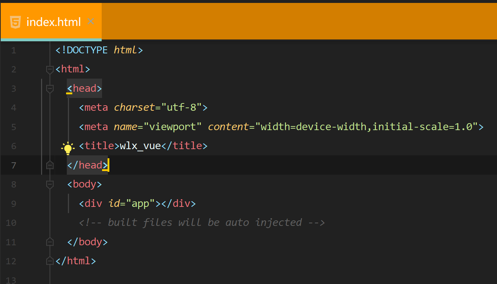

# www.wlxtech.com

## 搭建环境

### 服务器

纯净的阿里云linux ubuntu18.04 64位 服务器

ubuntu18.04自带python3.6.9和python2.7.17

### 域名

阿里云域名wlxtech.com

### 创建python虚拟环境

* **这里为了方便看目录结构，安装一个树形看目录结构的东西\(tree -a查看隐藏文件\)**

`sudo apt update`

`sudo apt install tree`


* **然后因为是原生环境，自带python2，所以python默认路径是python2，这里要改成python3，具体操作如下**

`update-alternatives --install /usr/bin/python python /usr/bin/python2.7 1`

`update-alternatives --install /usr/bin/python python /usr/bin/python3.6 1`

我们列出可用的 Python 替代版本

`update-alternatives --list python`

然后进行配置

`update-alternatives --config python`

然后输入2，即可把python命令的默认版本变成python3.6，具体操作如下图



**正式安装虚拟环境**

1  先更新pip和setuptools

`pip3 install --upgrade setuptools`

`pip3 install --upgrade pip`

2  安装依赖

`sudo pip install pbr`

3  安装虚拟环境virtualenv

`pip install virtualenv`

4 安装统一管理虚拟环境软件virtualenvwrapper

`pip install virtualenvwrapper`

执行下面两句（下一句是配置，将所有虚拟环境目录都放在`~/.virtualenvs`）

`export WORKON_HOME='~/.virtualenvs'` 

`source /usr/local/bin/virtualenvwrapper.sh`

然后将上面两行添加到~/.bashrc 中，这样每次启动终端的时候都会自动运行，

`source ~/.bashrc`   修改环境变量之后立即生效

5 创建并使用虚拟环境

创建虚拟环境\(mkvirtualenv -p python语言版本的路径 虚拟环境的名称\)

`mkvirtualenv -p /usr/bin/python3.6 blogs_test`

创建的虚拟环境在/root/.virtualenvs也就意味着，在该虚拟环境中安装的python相关的包，也在这

不在虚拟环境中安装的原生的python相关的包在哪里呢？ 在/usr/local/lib/python3.6/dist-packages

虚拟环境的一些操作（下面四个别执行）

进入虚拟环境命令：workon 虚拟环境名称

退出虚拟环境命令：deactivate

删除虚拟环境命令：rmvirtualenv  虚拟环境名称

列出所有环境命令：workon 或者 lsvirtualenv -b

6 在~目录下创建两个文件夹当项目文件夹，一个是正式用的，一个是测试的

`mkdir blogs`

`mkdir blogs_test`

## 安装Django

进入虚拟环境

`workon blogs_test`

安装指定版本的django

`pip install django==1.11.11`

查看一下安装的django，

`pip list` 或者 `pip freeze`

#### 创建一个django项目

`django-admin startproject myblogs`

运行一下试试

`python manage.py runserver`

**修改django的setting文件：**

`ALLOW_HOSTS=['47.94.7.122'] #改成阿里云的公网IP`

安装nginx

直接在终端安装，不用装在虚拟环境中，输入以下命令：

`apt-get update`

`apt-get install nginx`

安装成功后，用浏览器访问你的阿里云IP地址，可以看到以下提示 ：


然后nginx配置：打开配置文件default，路径/etc/nginx/sites-available/default，设置以下内容。一个是server\_name后面换成你的阿里云公网IP，有的文章说不换也行。关键是下面2个location，第一个location是设置的和uWSGI的关联。第二个location /static是设置的静态文件的路径。如果你的项目还有media文件夹，那还要加一个location /media，把路径设置上。注意：location 和alias后面有空格。 

```text
server_name 47.94.7.122;
location / {
    # First attempt to serve request as file, then
    # as directory, then fall back to displaying a 404.
    # try_files $uri $uri/ =404;
    include  uwsgi_params;
    uwsgi_pass  127.0.0.1:8000;
}
```

**uWSGI安装：**

这个是安装在虚拟环境中，先workon blogs\_test进入虚拟环境，安装uWSGI前需要先安装依赖，输入以下命令完成安装

apt-get install build-essential python

apt-get install python-dev

pip install uwsgi

配置uWSGI：在django项目的根目录\(myblogs\)下，新建两个文件，

uwsgi.ini和run.log 。

touch uwsgi.ini

touch run.log 

第一个是uWSGI的配置文件，第二个是日志记录文件。设置uwsgi.ini文件如下：

\[uwsgi\] chdir = /home/myweb  
module = myweb.wsgi:application socket = 127.0.0.1:8000  
master = true  
daemonize = /home/myweb/run.log disable-logging = true wsgi-file = /home/myweb/myweb/wsgi.py pidfile=/home/myweb/uwsgi.pid chdir是django项目所在目录，socket后面的地址是和上面nginx配置文件中的地址uwsgi\_pass 127.0.0.1:8000对应的，规定nginx和uWSGI之间的通信端口。daemonize就是日志文件的路径。disable-logging = true 表示不记录正常信息，只记录错误信息。wsgi-file是你django项目根目录下项目同名目录中有一个wsgi.py文件的路径。pidfile是uwsgi.pid文件的路径，这个文件是uWSGI运行后自动生成的，里面记录了uWSGI的进程号，可以用来重启uWSGI。但是我的uwsgi.pid文件记录的进程号老是不对，用不了。


uWSGI基本命令：

```text
启动：uwsgi --ini uwsgi.ini停止：uwsgi --stop uwsgi.pid重启：uwsgi --reload uwsgi.pid
```

全部配置好后，重启nginx和uWSGI，因该就可以用浏览器访问你的项目了。


```text
apt install uwsgi-plugin-python3
```


\`\`

